# xdfdet

**Where does a deepfake detector look?** This project studies how training-time preprocessing shapes an EfficientNet-B4 deepfake detector: its accuracy, its calibration, and the facial regions its decisions rely on, measured with Grad-CAM.

[Project page](https://xdfdet.mertkayacs.com) ([Türkçe](https://xdfdet.mertkayacs.com/tr/), [Deutsch](https://xdfdet.mertkayacs.com/de/)) · [Models on Hugging Face](https://huggingface.co/mertkayacs/xdfdet) · [Kaggle](https://www.kaggle.com/models/mertilovski/xdfdet) · [Thesis](https://doi.org/10.5281/zenodo.18998566)

<table>
  <tr>
    <td align="center">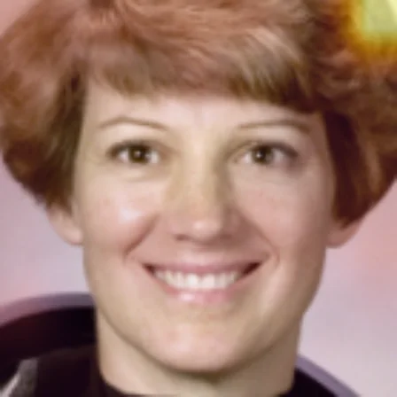<br><sub>Baseline</sub></td>
    <td align="center">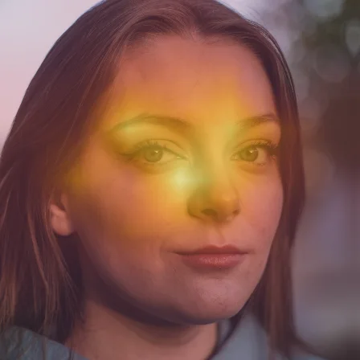<br><sub>Augmentation</sub></td>
    <td align="center">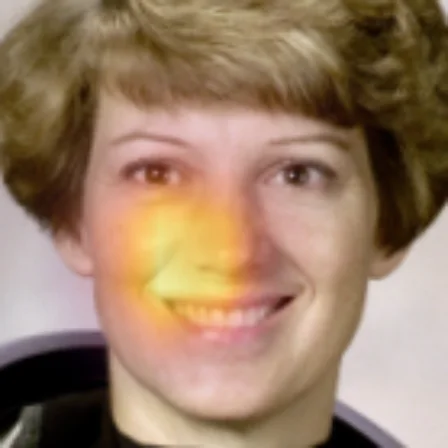<br><sub>Cutout</sub></td>
    <td align="center">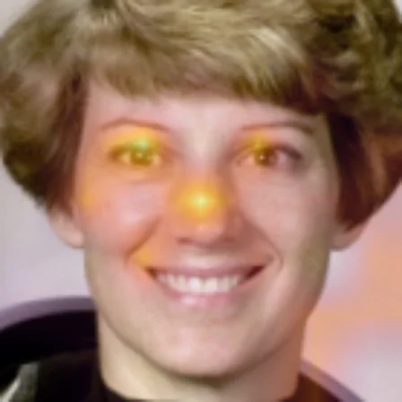<br><sub><b>Augmentation + cutout (best)</b></sub></td>
  </tr>
</table>

*Grad-CAM of four configurations on the same real, public-domain portrait. All four classify it as real, yet their activation maps differ: the baseline is weak and partly off the face, the best configuration concentrates on the eyes and eyebrows.*

This repository contains the code and eight trained models for the paper *Augmentation and Cutout in Deepfake Detection: A Comparative Study of Accuracy, Calibration, and Attention* (UBMK 2026) and the MSc thesis it comes from.

## Usage

```bash
pip install git+https://github.com/mertkayacs/xdfdet
xdfdet predict video.mp4 --gradcam cam.png
```

The command returns the probability that the video is real, the verdict, and a Grad-CAM overlay saved as `cam.png`. No dataset is required; the model weights are downloaded from Hugging Face on first use. Python 3.10 to 3.12.

<details>
<summary>Example output, Python usage and Colab</summary>

For a clip of the portrait above (a real person):

```json
{
  "video": "portrait.mp4",
  "model": "aug-cutout-black",
  "real_probability": 0.9996,
  "verdict": "real",
  "regions": {
    "jaw": 42.4, "left_eyebrow": 62.7, "right_eyebrow": 42.7, "nose": 62.8,
    "left_eye": 81.4, "right_eye": 57.2, "outer_mouth": 37.8, "inner_mouth": 37.3
  },
  "gradcam": "cam.png"
}
```

`regions` is the mean Grad-CAM activation (0 to 100) inside each facial region. Select another configuration with `--model`, for example `--model baseline`.

```python
import xdfdet
model = xdfdet.load_model("aug-cutout-black")   # Keras model, input (batch, 12, 224, 224, 3)
```

Or open [`notebooks/quickstart.ipynb`](notebooks/quickstart.ipynb) in Colab.

</details>

## Method

**1. Data and face extraction.** 1,000 real videos from FaceForensics++ are paired with one manipulated version each, and the faces are detected, aligned and cropped.

 

<sub>Real and manipulated frame from FaceForensics++ (from the thesis). Four manipulation methods in rotation: FaceSwap, Face2Face, FaceShifter, Deepfakes. MTCNN detection with eye alignment, 12 frames per model input.</sub>

**2. Nine training configurations.** One EfficientNet-B4 detector is trained under nine configurations that vary data augmentation and cutout. Cutout removes a facial region from the **fake frames only**; real frames receive a small star-shaped cutout instead.

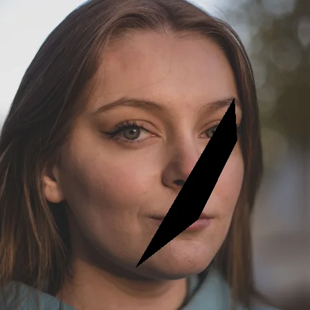 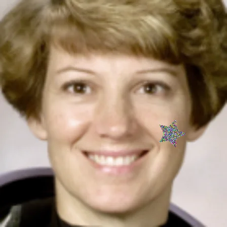

<sub>Left: cutout on a fake frame. Right: star cutout on a real frame. Cutout follows the winning solution of the Deepfake Detection Challenge ([Seferbekov, 2020](https://github.com/selimsef/dfdc_deepfake_challenge)), which dropped artefacts and face regions from training images to improve generalization. An SSIM map locates where the fake is most similar to its real source, and a landmark polygon over that area is filled with black, white or random pixels. The star on real frames uses the same fill, so a blank region alone never identifies a fake and the model does not overfit to pristine facial detail.</sub>

**3. Explainability analysis.** Grad-CAM maps are averaged over frames and measured in eight facial regions defined by 68 landmarks, separately for correct and incorrect predictions.

 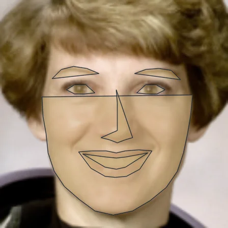

<sub>Grad-CAM of the best configuration and the eight region masks.</sub>

<details>
<summary><b>Full pipeline</b></summary>

Every image here except the FaceForensics++ frames is produced by [`scripts/make_figures.py`](scripts/make_figures.py), which runs the package's own functions on a public-domain portrait from scikit-image.

**Face detection.** MTCNN detects the face in every frame, aligns it by the eye positions and crops it to 224×224 pixels. Each video keeps 32 frames, of which the model receives 12.

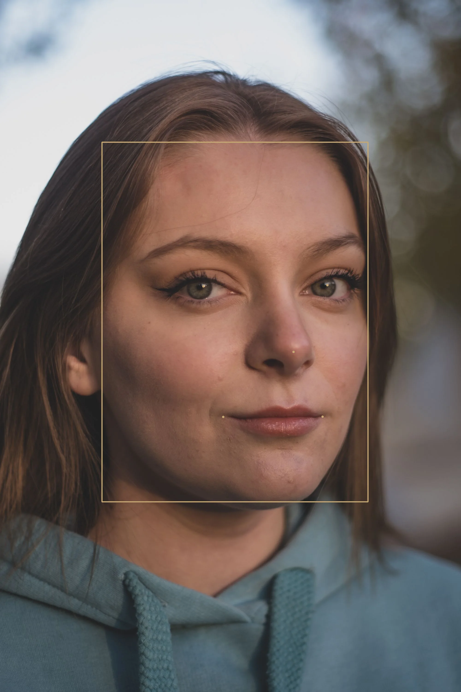 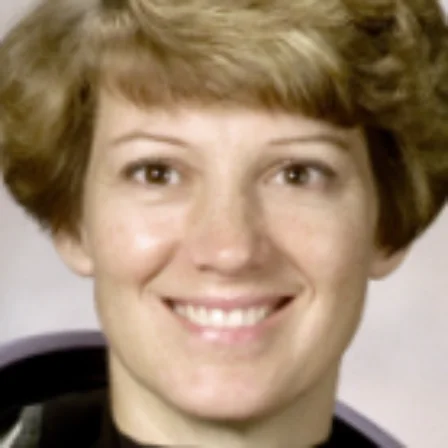

**Facial landmarks.** dlib places 68 landmarks that define the eight regions. The right image shows the masks exactly as scored; the jaw polygon closes across the lower face, so the jaw score also covers the cheeks, nose and mouth.

 

**SSIM difference map.** SSIM compares each fake frame with its real source. Bright areas differ; dark areas are nearly identical. The dark areas are where the fake already resembles the real face, and cutout targets them.

 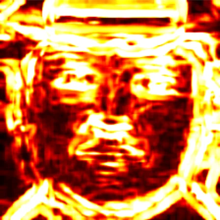 

**Cutout.** Applied to the fake frames only: a landmark polygon covering 2 to 5 percent of the frame, over the area SSIM marks as most similar, is filled with black, white or random pixels. Real frames receive a star-shaped cutout with an outer radius of 8 to 16 pixels and the same fill, each with probability 0.5.

 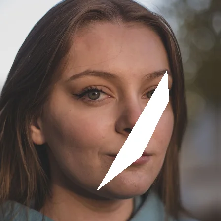 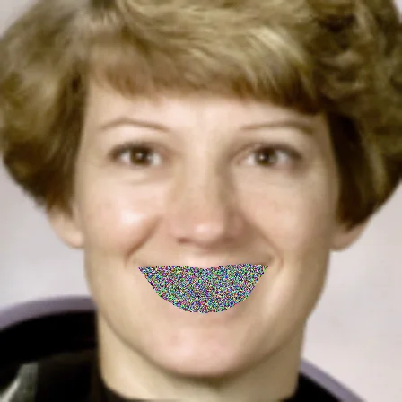 

**Data augmentation.** Albumentations adds noise, blur, slight color shifts, flips and small rotations. The intense setting applies them four to five times as often as the standard one. Below: input, one standard draw, one intense draw.

 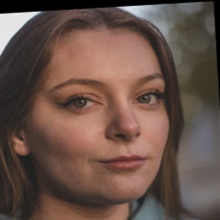 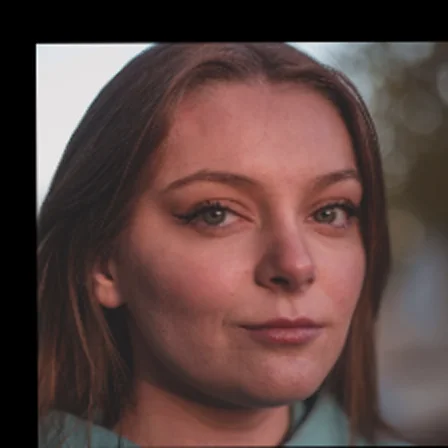

**Video-level prediction.** EfficientNet-B4 scores each of the 12 frames independently. The video score is the mean of the frame scores, and binary cross-entropy is computed on that mean. Scores below 0.5 are classified as fake.

**Grad-CAM.** Grad-CAM is computed on frames 0, 4 and 7, averaged, and measured inside each region. `xdfdet analyze` reports this per outcome (true and false positives and negatives).

</details>

## Results

1. **Augmentation with black-fill cutout performs best.** It achieves the highest AUC (0.8971 against 0.8678 for the baseline) and the best F1 and Brier scores, and it improves on the baseline in all four metrics.
2. **Metrics rank configurations differently.** Standard augmentation ranks last on AUC but second on F1, and the random-fill configuration has the lowest LogLoss. Evaluating a detector on a single metric hides these differences.
3. **The nose is a persistent weak point.** In the thesis region analysis the nose remains among the most active regions in both correct and incorrect decisions.

<details>
<summary><b>Full results table</b></summary>

AUC, F1, Brier and LogLoss on the FaceForensics++ test split. **Paper** is the mean ± std over three runs (Table II). **Released** is the single run whose weights are published, measured in its original notebook.

| Model | Paper AUC | Paper F1 | Paper Brier | Paper LogLoss | Released AUC | Released F1 | Released Brier | Released LogLoss |
|---|---|---|---|---|---|---|---|---|
| `baseline` | 0.8678 ± 0.0044 | 0.7780 ± 0.0065 | 0.1524 ± 0.0013 | 0.4827 ± 0.0069 | 0.8684 | 0.7781 | 0.1523 | 0.4827 |
| `aug-standard` | 0.8610 ± 0.0051 | 0.7955 ± 0.0084 | 0.1572 ± 0.0010 | 0.5719 ± 0.0084 | 0.8616 | 0.8025 | 0.1576 | 0.5719 |
| `aug-intense` | 0.8718 ± 0.0043 | 0.7932 ± 0.0077 | 0.1431 ± 0.0008 | 0.5288 ± 0.0081 | not released | | | |
| `cutout-random` | 0.8711 ± 0.0051 | 0.7769 ± 0.0069 | 0.1524 ± 0.0012 | 0.5241 ± 0.0078 | 0.8642 | 0.7774 | 0.1526 | 0.5241 |
| `cutout-black` | 0.8666 ± 0.0043 | 0.7912 ± 0.0077 | 0.1537 ± 0.0009 | 0.4989 ± 0.0074 | 0.8669 | 0.7911 | 0.1537 | 0.4989 |
| `cutout-white` | 0.8639 ± 0.0047 | 0.7704 ± 0.0074 | 0.1462 ± 0.0011 | 0.5244 ± 0.0076 | 0.8700 | 0.7703 | 0.1463 | 0.5244 |
| `aug-cutout-random` | 0.8837 ± 0.0072 | 0.7950 ± 0.0098 | 0.1450 ± 0.0011 | **0.4656 ± 0.0067** | 0.8820 | 0.7950 | 0.1451 | 0.4656 |
| `aug-cutout-black` | **0.8971 ± 0.0064** | **0.8429 ± 0.0101** | **0.1242 ± 0.0009** | 0.4710 ± 0.0063 | 0.8981 | 0.8431 | 0.1247 | 0.4710 |
| `aug-cutout-white` | 0.8734 ± 0.0061 | 0.7951 ± 0.0095 | 0.1455 ± 0.0012 | 0.4761 ± 0.0071 | 0.8734 | 0.7883 | 0.1451 | 0.4761 |

The nine settings:

| Augmentation ↓ · Cutout → | none | random fill | black fill | white fill |
|---|---|---|---|---|
| none | `baseline` | | | |
| flips only | | `cutout-random` | `cutout-black` | `cutout-white` |
| standard | `aug-standard` | `aug-cutout-random` | `aug-cutout-black` | `aug-cutout-white` |
| intense | `aug-intense` | | | |

Data, model, optimizer and training schedule are the same in every setting. The exact probabilities are in [`src/xdfdet/config.py`](src/xdfdet/config.py).

</details>

## Reproduce the study

Training and the full tables need FaceForensics++ from [its authors](https://github.com/ondyari/FaceForensics) (research use only) and a GPU; a Colab T4 is enough.

<details>
<summary><b>Step by step</b></summary>

1. Put the raw videos in one folder: real clips as `000.mp4, 001.mp4, ...`, fakes as `<Manipulation>/000_003.mp4`.
2. Crop the faces (MTCNN, eye-aligned, 32 frames, 224×224):
   ```bash
   xdfdet crop raw/ faces/
   ```
3. Train one setting. The split is 70/15/15 over 1,000 real/fake pairs, one manipulation per pair in rotation:
   ```bash
   xdfdet train --data faces/ --config aug-cutout-black --out aug-cutout-black.keras
   ```
4. Score the test split, then run the region analysis:
   ```bash
   xdfdet evaluate --data faces/ --model aug-cutout-black.keras
   xdfdet analyze  --data faces/ --model aug-cutout-black.keras --out regions.json
   ```

`analyze` reports, for each outcome (TP, TN, FP, FN, with fake as the positive class), the mean and spread of Grad-CAM activation in the eight regions.

Tests run on a CPU without the dataset: `pip install -e ".[test]" && pytest`. To redraw the figures: `python scripts/make_figures.py docs/figures`.

</details>

## Models

Eight trained detectors are available on [Hugging Face](https://huggingface.co/mertkayacs/xdfdet) and [Kaggle](https://www.kaggle.com/models/mertilovski/xdfdet) under CC BY-NC 4.0, one `.keras` file per configuration, named as in the tables. `xdfdet.load_model(name)` downloads and loads one. The checkpoint of the ninth configuration, `aug-intense`, was lost.

## Notes on the original runs

The code was rebuilt from the Colab notebooks behind the paper and checked against them. Reading those notebooks surfaced details the paper does not state.

<details>
<summary><b>Read these before comparing numbers</b></summary>

- **Splits.** Each notebook drew its own random 70/15/15 split with no fixed seed, so every configuration was tested on a different set of 150 pairs. A published checkpoint may have trained on videos that sit in another configuration's test set, so re-scoring the checkpoints on one common split would mix training and test data. This code seeds the split (`--seed 42`), so new runs are comparable.
- **Dropout.** The paper gives 0.55 for every model. The released `aug-cutout-random` checkpoint was trained with 0.25. Dropout is off at inference, so this affects how the model was trained and not how you use it.
- **Cutout-only models** kept Albumentations' `HorizontalFlip` at its default probability of 0.5, so they saw random flips.
- **Missing checkpoint.** The `aug-standard` and `aug-intense` runs saved to the same file name, and the later save overwrote `aug-intense`. Its row comes from the paper; there are no weights for it.
- **Jaw region.** The region masks are the landmark polygons filled as drawn. The jaw polygon (points 0 to 16) closes across the lower face, so its score overlaps the nose and mouth regions.
- **Precision.** Training and the reported scores ran in mixed float16 on a T4 GPU. The released files are float32 copies with identical weights, and scores can differ from the float16 runs, most near the 0.5 boundary. `conversion.json` on Hugging Face lists both for two test images. To score in the original precision on a GPU, use `xdfdet evaluate --mixed-precision` or `xdfdet.load_model(name, mixed_precision=True)`.
- **Loading the Colab checkpoints.** In Keras 3.10, `keras.models.load_model` on the original `.h5` files leaves EfficientNet's normalization layer inactive. The released models rebuild the architecture and copy the weights, which avoids this.
- **Input scaling.** Frames are normalized with ImageNet statistics before the model, and Keras' EfficientNet normalizes again inside. The weights were trained this way, so keep both steps.
- **Metrics.** F1 treats real as the positive class; the Grad-CAM outcomes treat fake as positive. Both follow the thesis.
- **Crop margin.** The thesis says faces were cropped "with a fixed margin" without giving a value. `xdfdet crop` uses 30% of the face box.

[`scripts/convert_checkpoints.py`](scripts/convert_checkpoints.py) shows how each Colab checkpoint was matched to its configuration and converted.

</details>

## Citation

```bibtex
@inproceedings{kaya2026augmentation,
  title     = {Augmentation and Cutout in Deepfake Detection: A Comparative Study of
               Accuracy, Calibration, and Attention},
  author    = {Kaya, Mert and Adanova, Venera},
  booktitle = {11th International Conference on Computer Science and Engineering (UBMK 2026)},
  year      = {2026},
  note      = {To appear}
}

@mastersthesis{kaya2025xdfdet,
  title  = {Explainable Deepfake Detection Using Frame Level CNN Models:
            A Comparative Study of Augmentation and Cutout Techniques},
  author = {Kaya, Mert},
  school = {TED University},
  year   = {2025},
  doi    = {10.5281/zenodo.18998566}
}
```

## License

Code: MIT (see [`LICENSE`](LICENSE)). Model weights: CC BY-NC 4.0, because they were trained on FaceForensics++, which is licensed for non-commercial research only. The FaceForensics++ frames in `docs/figures/thesis-*` come from the thesis (CC BY 4.0). The portrait is a public-domain NASA photo that ships with scikit-image.
